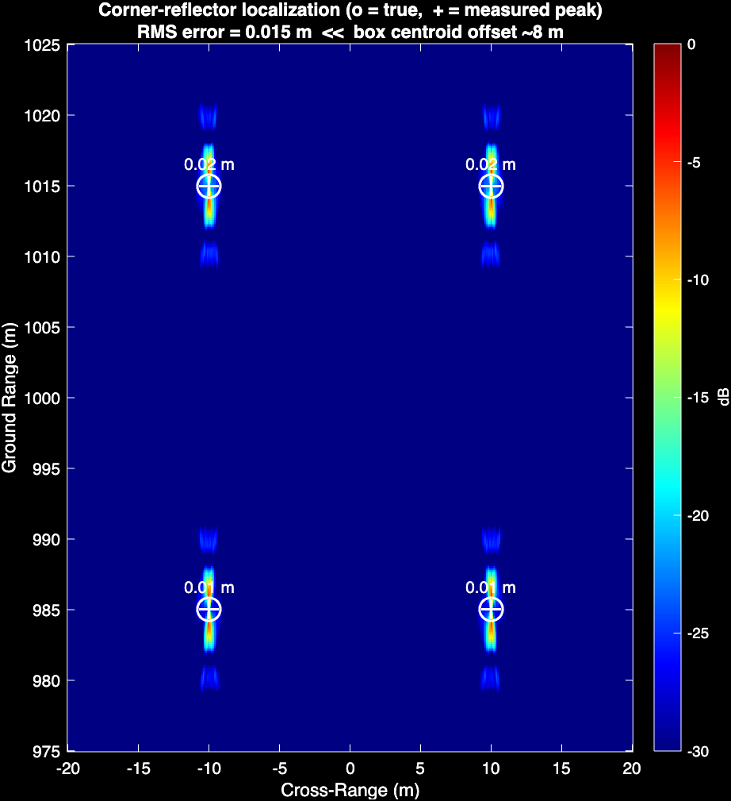
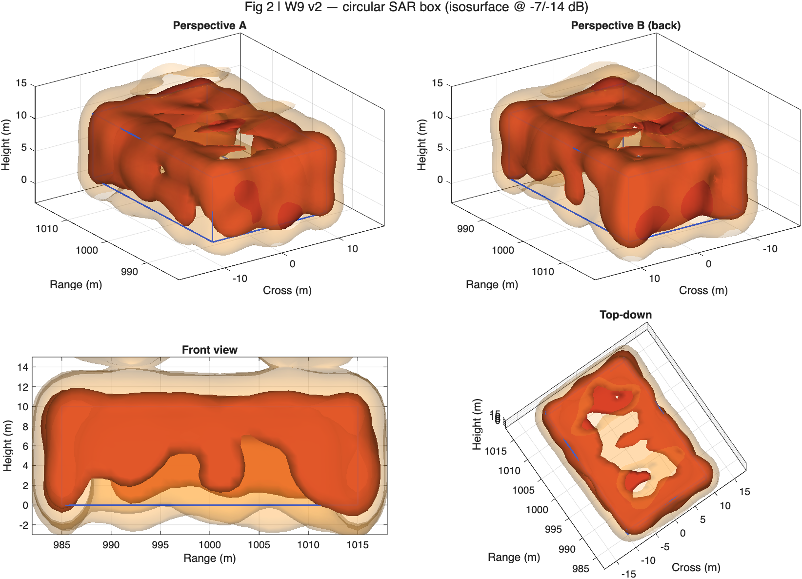
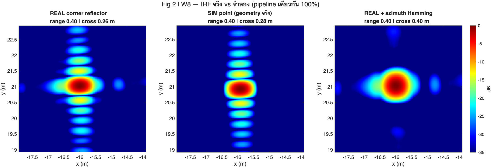
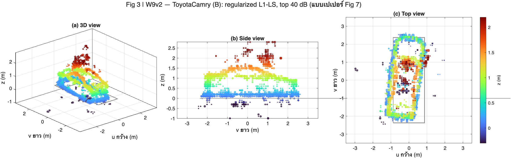
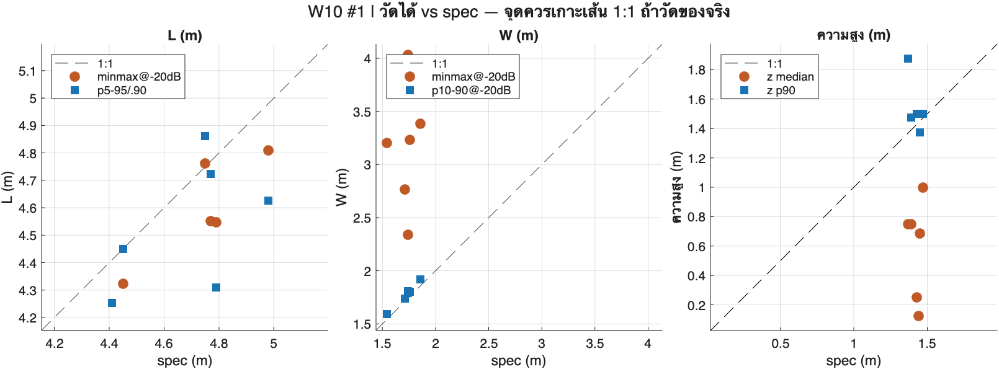

# SAR Image Formation Simulation Using MATLAB

**จาก simulated raw echo signal สู่การวัดขนาดรถยนต์จากข้อมูลเรดาร์บินจริง**

โปรเจกต์ฝึกงาน 10 สัปดาห์ ว่าด้วยการสร้างภาพ Synthetic Aperture Radar (SAR) ด้วย MATLAB
เริ่มจากจำลอง echo ของเป้าจุดเดียว ไปจนถึงสร้างภาพ 3 มิติของรถยนต์จากข้อมูลเรดาร์บินจริง
(AFRL GOTCHA) แล้ววัดขนาดรถออกมาเทียบกับสเปกผู้ผลิต

โค้ดทุกไฟล์รันได้อิสระ (standalone script) ไม่มี dependency ข้ามไฟล์นอกจาก cache ที่ระบุไว้

---

## ผลลัพธ์หลัก

| หัวข้อ | ผล | ไฟล์ที่ให้ผลนี้ |
|---|---|---|
| Backprojection บนเป้าจุด | range res 1.73 m, cross 0.093 m (ทฤษฎี 0.094), PSLR −13.8 dB | `02_box_2d/box_physics_rcs_noise.m` |
| Localization ด้วย corner reflector | RMS error 0.015 m | `02_box_2d/box_physics_rcs_noise.m` |
| กู้ความสูงกล่อง 3D (tomography) | height res 16 m → ~2 m | `03_box_3d/box_tomography_multipass.m` |
| Circular SAR บนกล่องจำลอง | กู้ผนังได้ 5/6 หน้า, wall-to-interior contrast 21.2 dB | `03_box_3d/box_circular_sar.m` |
| ภาพ 2D จากข้อมูล GOTCHA จริง | corner reflector อยู่ที่ (−15.91, 20.93) m เทียบ AFRL (−16, 21) — ต่าง ~0.1 m | `04_gotcha_real/main/gotcha_bp_2d.m` |
| Sparse 3D (k-space L1 ตามเปเปอร์) | tophat ออกมาเป็นวงแหวนรัศมี 1.00 m ตรงขนาดจริง | `04_gotcha_real/main/gotcha_sparse3d_showcase.m` |
| วัดความกว้างรถ | r = 0.993 กับสเปกจริง, กระจาย ±0.014 m หลังหัก bias | `04_gotcha_real/analysis/measure_size_robust.m` |
| วัดความยาว / ความสูงรถ | **วัดไม่ได้** — ดูหัวข้อ "ข้อจำกัดที่ยืนยันแล้ว" | `04_gotcha_real/analysis/measure_size_robust.m` |

---

## ภาพผลลัพธ์ของแต่ละช่วง

### `02_box_2d/` — ความแม่นของการหาตำแหน่ง



ยิงตัวสะท้อนมุม 4 ตัวที่มุมกล่องซึ่งรู้ตำแหน่งแน่นอน แล้ววัดว่ายอดในภาพตกห่างจากจุดจริงเท่าไหร่
**RMS error 0.015 ม.** — ยืนยันว่าที่ W5 เคยรายงานว่า "ตำแหน่งคลาด 17.6 ม." นั้นคือจุดศูนย์กลาง
ความสว่างของกล่อง ไม่ใช่ความคลาดของเรดาร์

> resolution จริงที่วัดบนเป้าจุดเดียว: **range 1.73 ม.** · **cross 0.093 ม.** (ทฤษฎี 0.094) · **PSLR −13.8 dB**
>
> ค่า range ไม่ได้เทียบกับ `c/2B = 3.00 ม.` เพราะสูตรนั้นใช้ไม่ได้ตรง ๆ กับภาพที่โฟกัสแล้ว —
> ค่าที่ควรเทียบคือ 1.85 ม. ดู [`docs/SAR101.md` §3.1](docs/SAR101.md)

### `03_box_3d/` — Circular SAR กู้กล่องเต็มใบ



บินวนรอบกล่องแบบ GOTCHA (24 arcs × 8 passes) + Taylor window −35 dB + multilook
กู้ผนังได้ **5 จาก 6 หน้า** (หน้าล่างวางบนพื้น มองไม่เห็นแน่นอน) ทุกหน้าที่เห็นแรงใกล้กัน
(−2.6 ถึง −6.8 dB) และ wall-to-interior contrast **21.2 dB**

> **height resolution ~3 ม.** (ทฤษฎี 3.0) — จากเดิมที่ภาพ 2 มิติทำความสูงหายไปทั้งหมด

### `04_gotcha_real/` — จำลอง เทียบ ของจริง



เอา point target จำลองไปวางที่ตำแหน่งตัวสะท้อนสอบเทียบจริง ด้วย geometry และแกนความถี่ชุดเดียวกัน
แล้วเทียบหน้าตาของ impulse response

> **range: จริง 0.40 · จำลอง 0.40 ม.**  ·  **cross: จริง 0.26 · จำลอง 0.28 ม.**  (ทฤษฎี 0.31 / 0.22)
> ภาพขวาคือผลของการใส่ azimuth window — sidelobe หายไป แลกกับ cross ที่กว้างขึ้นเป็น 0.40 ม.

### `04_gotcha_real/` — Sparse 3D: รูปรถ



Toyota Camry คันเดียวกับที่เปเปอร์ใช้ สร้างด้วย k-space L1 + FISTA เห็นตัวถัง เส้นพื้น
และแนวหลังคาชัดเจน

> footprint อยู่ในกรอบ ground truth 4.75 × 1.74 ม. **81%** · แนวหลังคา **~1.5 ม.** (สเปก 1.43)
> · ลด "หมอก" จาก 34,221 เหลือ **1,483 voxel**

### `04_gotcha_real/` — ความกว้างวัดได้ ความยาววัดไม่ได้



แกนนอนคือขนาดจริงจากสเปก แกนตั้งคือค่าที่วัดได้จากภาพ 3 มิติ — จุดที่ตกบนเส้นทแยง 1:1
แปลว่าตัววัดตามค่าจริงได้

> **ความกว้าง (น้ำเงิน): r = 0.993** อยู่บนเส้น · กระจาย ±0.014 ม. ≈ 1/9 voxel
> **ความยาวกับความสูง: กระจัดกระจายออกจากเส้น** — ไม่ได้ตามค่าจริงเลย

---

## สิ่งที่ต้องมีก่อนรัน

**MATLAB** — พัฒนาและทดสอบบน **R2026a** (ขั้นต่ำน่าจะรันได้ตั้งแต่ R2020a เพราะฟังก์ชันที่ใหม่ที่สุดที่ใช้คือ `exportgraphics`)

**Toolbox ที่จำเป็น**

| Toolbox | ใช้ทำอะไร | ไฟล์ที่ต้องใช้ |
|---|---|---|
| Phased Array System Toolbox | `phased.LinearFMWaveform`, `phased.Platform`, `phased.Transmitter`, `phased.FreeSpace` ฯลฯ | `01_`, `02_` ทั้งหมด |
| Signal Processing Toolbox | `taylorwin` (กด range sidelobe) | `03_`, `04_` |
| Image Processing Toolbox | `smooth3` (แสดงผล isosurface) | `03_` |

`04_gotcha_real/` ไม่ใช้ Phased Array Toolbox เลย — ทำงานกับ phase history ดิบตรง ๆ

---

## ข้อมูล GOTCHA (ไม่ได้แนบมาใน repo)

โฟลเดอร์ `04_gotcha_real/` ต้องใช้ชุดข้อมูล **AFRL GOTCHA Volumetric SAR Data Set, Version 1.0**
ซึ่งเป็นข้อมูลของกองทัพอากาศสหรัฐฯ ที่ต้องลงทะเบียนขอเอง — **แจกจ่ายต่อไม่ได้ จึงไม่อยู่ใน repo นี้**

ขอได้ที่ Sensor Data Management System (SDMS) ของ AFRL: <https://www.sdms.afrl.af.mil>
(ชุดชื่อ *GOTCHA Volumetric SAR* / *Challenge Problem* — ต้องสมัครบัญชีและยอมรับเงื่อนไขก่อน)

เมื่อได้มาแล้ว วางไว้ข้าง ๆ repo ตามโครงนี้ (โค้ดหาไฟล์ด้วย path สัมพัทธ์จากตัวสคริปต์เอง):

```
<repo>/
└── data/
    ├── GOTCHA-CP_Disc1/                 <- pass 1 ถึง 7
    │   ├── DATA/pass1/HH/data_3dsar_pass1_az001_HH.mat  ...
    │   └── DOCUMENTATION/
    │       ├── Gotcha Spotlight Target Locations.xls   <- ground truth ตำแหน่ง+ขนาดรถ
    │       └── Challenge_Pictures_Images.ppt           <- รูปถ่ายรถจริง
    └── GOTCHA-CP_Disc2/                 <- pass 8 เพียง pass เดียว
        └── DATA/pass8/{HH,HV,VH,VV}/
```

> **Disc2 เล็กกว่า Disc1 มากเป็นเรื่องปกติ** — Disc1 เก็บ pass 1–7 (~1.8 GB)
> ส่วน Disc2 เก็บแค่ pass 8 (~73 MB) ไม่ใช่ว่าดาวน์โหลดมาไม่ครบ
>
> ชุดเต็มคือ **8 pass × 360 องศา × 4 polarization** = 11,520 ไฟล์ (1 ไฟล์ = 1 องศา)
> โค้ดสลับ disc ให้เองด้วย `dsc = 1 + (pn == 8)` จึงไม่ต้องรวมโฟลเดอร์เอง

โครงสร้างของแต่ละไฟล์ `.mat` — struct ชื่อ `data` มี field:

| field | ขนาด | คือ |
|---|---|---|
| `fp` | Nf × Np complex | phase history (frequency × pulse) |
| `freq` | Nf × 1 | ความถี่ (Hz) — X-band ~9.6 GHz, BW 624 MHz |
| `x, y, z` | 1 × Np | ตำแหน่งสายอากาศ 3 มิติต่อพัลส์ (m) |
| `r0` | 1 × Np | ระยะสายอากาศถึงจุดศูนย์กลางฉาก (m) |
| `af` | struct | ค่าแก้ autofocus: `r_correct` (m), `ph_correct` (rad) |

> **หมายเหตุสำคัญเรื่อง `freq`** — จำนวน frequency bin (`Nf`) **ไม่เท่ากันทุกไฟล์**
> ต้องเก็บ `freq` แยกราย pass ห้าม assume ว่าใช้แกนเดียวกันได้ทั้งหมด
>
> **หมายเหตุเรื่อง `af`** — ต้องใช้ทั้งสองค่าคู่กันเสมอ:
> `r0 ← r0 + r_correct` และ `fp ← fp .* exp(+1i*ph_correct)`
> ถ้าใส่เครื่องหมายผิดหรือใช้แค่เฟสอย่างเดียว ภาพพังทันที (image entropy พุ่งไป ~9.8)

ถ้ายังไม่มีข้อมูล ให้เริ่มจากโฟลเดอร์ `01_`–`03_` ได้เลย — เป็นการจำลองล้วน ไม่ต้องใช้ข้อมูลภายนอก

---

## โครงสร้างโปรเจกต์

```
01_point_target/     เป้าจุด 3 จุด → BP ภาพ 2 มิติ            (สัปดาห์ 1–4)
02_box_2d/           เป้ากล่อง 3 มิติ → ภาพ 2 มิติ + แก้วิธีวัด  (สัปดาห์ 4–6)
03_box_3d/           เป้ากล่อง 3 มิติ → ภาพ 3 มิติ              (สัปดาห์ 7)
04_gotcha_real/      ข้อมูลเรดาร์จริง → ภาพ 3 มิติ + วัดขนาด    (สัปดาห์ 8–10)
docs/                เอกสารประกอบ
```

### เอกสารใน `docs/`

| ไฟล์ | คืออะไร |
|---|---|
| `SAR101.md` | **อ่านก่อนถ้าเพิ่งเริ่ม** — พื้นฐาน SAR, pipeline 3 ขั้น, สูตรที่คุม resolution, คำอธิบายพารามิเตอร์ทุกตัว, อภิธานศัพท์ |
| `SAR_Project_Recap.pdf` | สไลด์สรุปทั้งโปรเจกต์ — ภาพรวม, SAR 101, ผลราย stage, ข้อสรุปที่ปรับแก้, บทเรียน |
| `GOTCHA_Writeup.pdf` | รายงานฉบับเต็มของช่วง GOTCHA (สัปดาห์ 8–10) พร้อมบันทึกรายละเอียดสำหรับคนทำต่อ |
| `vehicle_summary_table.html` | ตารางผลราย 9 คัน พร้อมรูปประกอบ เปิดไฟล์เดียวจบ |

> สไลด์รายสัปดาห์ชุดเดิม (W1–W10) **ไม่ได้อยู่ใน repo** — เนื้อหาถูกยุบรวมและปรับตัวเลขให้เป็น
> ปัจจุบันแล้วใน `SAR_Project_Recap.pdf` ตัวเดียว

แต่ละโฟลเดอร์แบ่งย่อยเป็น

- **ไฟล์หลัก** (อยู่ระดับบนสุด) — เส้นทางหลักของงาน รันตามลำดับเลข
- `proofs/` — สคริปต์ที่มีไว้**พิสูจน์ข้อสงสัย**อย่างเดียว ไม่ใช่เส้นทางหลัก
  แต่เก็บไว้เพราะเป็นหลักฐานว่าทำไมถึงเชื่อผลในไฟล์หลัก
- `analysis/` (เฉพาะ `04_`) — วัดผลจาก reconstruction ที่ทำไว้แล้ว ไม่ได้ทำ recon ใหม่

---

## ลำดับการรัน

### 01 — เป้าจุด (ไม่ต้องใช้ข้อมูลภายนอก, ~1 นาที)

```
point3_bp_2d.m                       รันไฟล์เดียวได้ครบทุกขั้น + เซฟรูปให้อัตโนมัติ
proofs/exact_resolution_measure.m    วัด resolution บนกริดละเอียด (ที่มาของตัวเลขใน docs/SAR101.md §3.1)
```

จำลอง LFM chirp → raw echo ของเป้า 3 จุด → range compression → backprojection → วัดผล
ไฟล์เดียวจบทั้ง pipeline เหมาะเป็นจุดเริ่มสำหรับคนที่เพิ่งเริ่ม

### 02 — กล่อง 3 มิติ, ภาพ 2 มิติ (ไม่ต้องใช้ข้อมูลภายนอก)

```
1. box_bp_2d.m                  กล่อง 6 หน้า 216 scatterer, RCS ตั้งมือ        ~2 นาที
2. box_bp_2d_figures3d.m        เหมือนข้อ 1 แต่ทุกรูปเป็น 3D visualization      ~2 นาที
3. box_physics_rcs_noise.m      RCS จากสูตรฟิสิกส์ + occlusion + noise study
                                + calibration บนเป้าจุด + corner localization   ~3 นาที
4. box_compare_rda_density.m    เทียบทีละ step + ทดสอบความหนาแน่นจุด
                                + Backprojection vs Range-Doppler               ~4 นาที

proofs/eval_method_control.m    ตัวคุม: ใช้ RCS แบบเก่า + วิธีวัดแบบใหม่
                                → พิสูจน์ว่าตัวเลขที่ดูเพี้ยนมาจากวิธีวัด ไม่ใช่ RCS
```

### 03 — กล่อง 3 มิติ, ภาพ 3 มิติ (ไม่ต้องใช้ข้อมูลภายนอก)

```
1. box_bp_3d_singlepass.m       ขยาย BP เป็น voxel grid — เห็นว่าความสูงยัง smear   ~3 นาที
2. box_tomography_multipass.m   บินซ้ำ 21 ชั้นยกสูง → กู้ความสูงได้                ~5 นาที
3. box_multiaspect_4dir.m       ทำข้อ 2 ซ้ำ 4 ทิศรอบกล่อง → ได้ผนังครบ            ~15 นาที
4. box_circular_sar.m           วนรอบแบบ GOTCHA + Taylor window + multilook       ~5–8 นาที

proofs/circular_seed_test.m         รันหลาย seed → พิสูจน์ว่ากล่องที่เห็นไม่ใช่ artifact ของเลขสุ่ม
proofs/circular_sar_xband.m         โคลนข้อ 4 เป็น X-band เพื่อเทียบ                ~10–16 นาที
proofs/resolution_cband_vs_xband.m  วัด resolution จริงบนเป้าจุด C-band vs X-band   ~30–60 วินาที
```

> ทำไมต้องมี `resolution_cband_vs_xband.m` แยก — `box_circular_sar*.m` ใช้ฉากเป็นกล่องผิวหยาบ
> (สุ่มเฟส) ซึ่งมี speckle เต็ม วัด −3 dB บนยอด speckle ไม่ได้ ต้องวัดบนเป้าจุดเดียวด้วย grid ละเอียด

### 04 — ข้อมูล GOTCHA จริง (**ต้องมีข้อมูลก่อน**)

```
main/
  0. gotcha_bp_minimal.m          ตัวอย่างสั้น ~50 บรรทัด: โหลด .mat → BP → ได้ภาพ
                                  (เริ่มที่ไฟล์นี้ถ้าเพิ่งแตะข้อมูลจริงครั้งแรก)      <1 นาที
  1. gotcha_bp_2d.m               ภาพ 2 มิติเต็มรูป + windowing + autofocus
                                  + เทียบ sim vs real + tomography 8 pass          ~1–2 นาที
                                                                        (+ tomo ~5–10 นาที)
  2. gotcha_sparse3d_showcase.m   k-space L1 + FISTA — รัน 1 เป้า (Camry / tophat)
                                  grid 100³ @0.10 m, 144 looks             >>> เขียน cache
  3. gotcha_sparse3d_vehicles.m   engine เดียวกัน วนรถ 9 คัน               >>> เขียน cache

analysis/
  4. measure_size_robust.m        วัด L/W/H ด้วย percentile + จัดอันดับ estimator
                                  ด้วย correlation + null model + leave-one-out    ไม่กี่วินาที
  5. measure_positions.m          วัดตำแหน่งรถจากภาพ 3 มิติเทียบ .xls              ไม่กี่วินาที

proofs/
  sidelobe_ghost_sweep.m          กวาดเกณฑ์ −8 → −30 dB พิสูจน์ว่า ghost = sidelobe ของ aperture
  phase_refine_negative.m         **ผลเป็นลบ** — per-pass autofocus ทำ ghost แย่ลง
  prizm_edge_density_void.m       **วิธีที่ใช้ไม่ได้** (ตัวคุมไม่ผ่าน) — เก็บไว้กันคนทำซ้ำ

tools/
  extract_car_photos.m            แกะรูป JPEG ที่ฝังใน .ppt ของ AFRL ออกมา
```

### แผนผัง dependency (สำคัญ)

```
gotcha_sparse3d_vehicles.m ──เขียน──> figure/w9cmp2_cache.mat
                                             │
                                             ├──> measure_size_robust.m
                                             ├──> measure_positions.m
                                             ├──> sidelobe_ghost_sweep.m
                                             ├──> phase_refine_negative.m
                                             └──> prizm_edge_density_void.m

gotcha_sparse3d_showcase.m ──เขียน──> figure/w9v3_cache_<target>.mat
                                             │
                                             └──> measure_size_robust.m (ใช้ตรวจอิสระ)
```

> **ไฟล์ cache ไม่ได้อยู่ใน repo** (ใหญ่ ~44 MB และสร้างใหม่ได้)
> สคริปต์ในกลุ่ม `analysis/` และ `proofs/` ส่วนใหญ่ **รันไม่ได้จนกว่าจะรัน
> `gotcha_sparse3d_vehicles.m` ให้จบก่อน** ซึ่งต้องมีข้อมูล GOTCHA
>
> **เวลารันของ `gotcha_sparse3d_vehicles.m`**
> — รันเต็มจากศูนย์ (ต้องอ่าน phase history ใหม่ทั้งหมด) ~**2–3 ชั่วโมง**
> — ถ้ามี cache อยู่แล้ว ~**15 นาที**
>
> เผื่อเวลาไว้ตามนี้ก่อนเริ่ม และอย่าปิดเครื่องกลางทาง — ถ้าล้มระหว่างรันจะต้องเริ่มใหม่ทั้งหมด

---

## พารามิเตอร์ที่ validate แล้ว (อย่าเปลี่ยนโดยไม่มีเหตุผล)

ค่าเหล่านี้ในโฟลเดอร์ `04_` ผ่านการทดลองหาค่ามาแล้ว เปลี่ยนแล้วผลจะไม่ตรงกับที่รายงาน

| ค่า | ใช้ | ทำไมค่านี้ |
|---|---|---|
| `NsigCFAR = 30` | threshold ของ FISTA | ต่ำกว่านี้เหลือ "หมอก" (34,221 voxel), เจตนาเดียวกับ λ=10 ของเปเปอร์ |
| `nIterFISTA = 200` | จำนวนรอบ | น้อยกว่านี้ L1 แยก ghost แฝดไม่ทัน |
| `gateRng = 3.5`, `gateCrs = 4.5` | spotlight รอบเป้า | กว้างกว่านี้รถคันข้าง ๆ wrap เข้ามาในกรอบ (ภาพ FFT ซ้ำทุก 10 m) |
| `subApWidth = 5` (องศา) | ความกว้าง subaperture | ตามเปเปอร์ |
| `topDB = 40` | ช่วง dB ที่แสดง | ตามเปเปอร์ (ไม่ใช่ −10 dB) |
| `relFloor = 0.02` | พื้น threshold สัมพัทธ์ | |

---

## ข้อจำกัดที่ยืนยันแล้ว — อ่านก่อนทำต่อ

### ความกว้างวัดได้ ความยาววัดไม่ได้ ความสูงติดเพดานฟิสิกส์

| มิติ | r กับสเปกจริง | สถานะ |
|---|---|---|
| ความกว้าง (W) | +0.993 | **ใช้ได้** — กระจาย ±0.014 m ≈ 1/9 voxel เฉพาะกับรถเก๋ง |
| ความยาว (L) | +0.52 | **ไม่มี skill** — แพ้การเดาค่าเฉลี่ยของกลุ่ม |
| ความสูง (H) | — | **วัดไม่ได้** จาก 3 สาเหตุซ้อนกัน |

รถแทรกเตอร์และรถยกทำให้ตัววัดความกว้างพัง (คลาด −1.33 / +1.26 m) — แต่ตัวความพังเองใช้เป็น
สัญญาณแยกประเภทยานพาหนะได้

**ทำไมความสูงถึงวัดไม่ได้** — สามชั้น ทุกชั้นตรวจสอบแล้ว

1. **ไม่มี ground truth** — ตาราง AFRL ให้แค่ความยาวกับความกว้าง ค่าความสูงหลังคาที่ใช้อ้างอิง
   มาจากสเปกผู้ผลิตบนเว็บ ตรงกันภายใน ±0.02 m ทุกคัน **ยกเว้น Camry** ที่แยกรุ่นปีไม่ได้
   (XV20 = 1.41 m / XV30 = 1.50 m ต่างกัน 0.086 m = 2/3 ของช่วงความสูงทั้งกลุ่ม)
2. **ตัววัดไม่ได้วัดหลังคา** — z p90 กอง voxel ทั้งคันรวมกัน (ฝากระโปรง + หลังคา + ghost)
   ค่าของ Camry ที่ "ดูตรง" คือ ghost ที่ 2.0 m กับพื้นที่ 0.25 m หักล้างกันพอดี
3. **เพดานของ aperture** — 8 pass กินมุม elevation แค่ ~1.7–2.65° → sidelobe อยู่ที่ **−8.9 dB**
   ซึ่งสูงกว่าเกณฑ์วัด −20 dB มาก ทุกจุดจึงสร้างสำเนาปลอมเหนือตัวเอง
   *พิสูจน์:* ยกเกณฑ์ขึ้นเหนือ −8.9 dB แล้ว ghost ยุบเป็น 0% พร้อมกัน 8 ใน 9 คัน
   → เป็นสมบัติของ aperture ไม่ใช่ของรถ (`proofs/sidelobe_ghost_sweep.m`)

โจทย์นี้ตรงกับที่ AFRL ระบุไว้เองในเอกสาร challenge:
*"Research interest is focused on mitigating the large side lobes in the PSF due to the
sparse nature of the elevation aperture"*

### ข้อสรุปที่ปรับแก้ระหว่างทาง

โปรเจกต์นี้กลับไปแก้ข้อสรุปตัวเอง 3 ครั้ง ตารางข้างล่างคือสิ่งที่เปลี่ยนและเหตุผล
**ค่าที่ถือเป็นทางการคือคอลัมน์ "แก้เป็น"** — สไลด์รายสัปดาห์ชุดเดิมที่ยังมีตัวเลขเก่าไม่ได้อัปขึ้น repo

| เคยรายงานไว้ | แก้เป็น | เพราะ |
|---|---|---|
| สัปดาห์ 1–4: range res 3.00 m ตรงทฤษฎีพอดี | **1.51 / 1.74 / 2.15 m** แล้วแต่ระยะ | ค่า 3.00 เป็นการปัดจากกริดที่ห่าง 2 m และวัดที่ระดับ −6 dB แทน −3 dB — ค่าจริงแคบกว่าเพราะ BP รวมข้ามมุมกวาด 17–28° (ดู `docs/SAR101.md` §3.1) |
| สัปดาห์ 5: range res 7.88 m, cross 20 m, PSLR −3.4 dB, offset 17.6 m | ไม่ใช่ค่า resolution — เป็น **ขนาดของกล่อง** ค่า resolution จริงคือ 1.73 / 0.093 m, PSLR −13.8 dB | metric พวกนี้นิยามบนเป้าจุดเดี่ยว กล่อง 216 จุดจึงวัดได้แค่ extent |
| สัปดาห์ 8: ตรวจพบรถ **11/11 คัน** | **9/11 คัน** | รถ G กับ H อยู่ที่ระดับ clutter (−36, −39.9 dB) สูงกว่าเกณฑ์แค่ 2–6 dB — ข้อมูลที่ปล่อยจริงไม่มีรถสองคันนี้ ส่วนเอกสาร AFRL เองก็ขัดกัน (ภาพอ้างอิงมาจากคนละ session) |
| สัปดาห์ 9: ความยาววัดแม่นสุด ความกว้างแย่สุด | **กลับด้าน** — ความกว้างใช้ได้ ความยาวไม่มี skill | สัปดาห์ 9 จัดอันดับด้วย MAE ซึ่งใช้ไม่ได้เมื่อเป้าขนาดใกล้กัน (เก๋ง 6 คันยาว 4.41–4.98 m) ตัววัดที่ "ทายค่ากลางทุกคัน" ก็ได้ MAE ต่ำ ทั้งที่ไม่มีข้อมูลแยกแยะเลย |
| สัปดาห์ 9: min/max extent เป็นตัววัดขนาด | **ถอนออก** ใช้ percentile แทน | voxel หลงจุดเดียวกำหนดคำตอบทั้งหมด — ความกว้างเกินจริงได้ถึง +4.2 m |
| ค่าอ้างอิงรัศมี tophat 0.75 m | **~1.00–1.15 m** | ค่า 0.75 m ที่ใช้มานานผิด ตรวจกับภาพ reconstruction แล้ว |

> **บทเรียนเชิงวิธีการที่สำคัญที่สุดของโปรเจกต์นี้:**
> ห้ามจัดอันดับ estimator ด้วยค่าคลาดเคลื่อนเฉลี่ย (MAE) อย่างเดียว
> ต้องดู correlation กับค่าจริง แล้วเทียบกับ null model ("ถ้าเดาค่าเฉลี่ยไปเลยจะได้เท่าไหร่")
> เสมอ ไม่งั้นจะได้ตัววัดที่ดูแม่นแต่ไม่ได้วัดอะไรจริง ๆ

### ผลเป็นลบที่บันทึกไว้ (อย่าทำซ้ำ)

- `proofs/phase_refine_negative.m` — per-pass phase autofocus ที่ตำแหน่งเป้า ทำให้ค่า sharpness
  ดีขึ้น 13–41% **แต่ ghost แย่ลง** (27% → 44%) บทเรียน: sharpness เป็น metric ที่โกงได้
  เพราะมันไม่สนว่าพลังงานไปกระจุกอยู่ตรงไหน
- `proofs/prizm_edge_density_void.m` — วิธี edge-density **ใช้ไม่ได้** ตัวคุมไม่ผ่าน
  (มีป้ายเตือนอยู่หัวไฟล์แล้ว) คำถามเดิมได้คำตอบจากตัววัดความกว้างแทน
- **กู้ความสูงจาก layover โดยตรง** — ลองแล้ว 3 รอบ **ยังไม่สำเร็จ** ตัวกรองกำจัดยอดปลอมได้สะอาด
  และอ่านเป้าสอบเทียบ tophat ได้ ~1.15 m แต่**อ่านค่ารถยังไม่ได้** จึงไม่ได้เอาโค้ดส่วนนี้ขึ้น repo
  รายละเอียดว่าลองอะไรไปบ้างและติดตรงไหน อยู่ในภาคผนวกของ `docs/GOTCHA_Writeup.pdf`

---

## ถ้าจะทำต่อ

1. **Polarimetry เพื่อกู้ความสูง** — Ertin (2007) หัวข้อ 4 ใช้ข้อมูล polarization แยกจุดสะท้อน
   odd-bounce (ขอบบนรถ ซึ่งโดน layover เลื่อนออกไป) ออกจาก even-bounce (แนวข้างรถกับพื้น
   ซึ่งอยู่ตำแหน่งจริง) ระยะห่างระหว่างคู่คือความสูง — ต้อง calibrate ช่อง HH/VV ที่ tophat ก่อน
2. **เปลี่ยน L1 เป็น Lp ที่ p < 1** — ตอนนี้ลงโทษด้วย `‖x‖₁` ซึ่งมี *shrinkage bias*
   คือหดแอมพลิจูดของ scatterer ที่แรงจริงลงไปด้วย ถ้าใช้ `p < 1` ฟังก์ชันลงโทษจะเป็นเส้นโค้งคว่ำ
   กด voxel อ่อนเป็นศูนย์แรงกว่า แต่ scatterer แรงยังเก็บแอมพลิจูดครบ → ภาพคมขึ้น
   แลกกับที่ปัญหาไม่เป็น convex อีกต่อไป อาจติด local minimum และผลขึ้นกับค่าเริ่มต้น
   ในโค้ดคือเปลี่ยน soft-threshold ใน `fistaKspace` เป็น shrinkage แบบ non-convex หรือใช้ IRLS
3. **ใช้ชุด CVDomes เป็น testbed** — เป็นข้อมูลจำลองที่มีความสูงจาก CAD เป็น ground truth
   จริง ๆ ซึ่งเป็นสิ่งที่ GOTCHA ไม่มี ใช้ทดสอบตัววัดความสูงได้ตรง ๆ

> บันทึกรายละเอียดของงานที่ยังไม่จบ — โดยเฉพาะ layover height ที่ลองไป 3 รอบ เจออะไร
> และทำไมถึงหยุด — อยู่ในภาคผนวกของ `docs/GOTCHA_Writeup.pdf`

---

## หมายเหตุ

- คอมเมนต์ในโค้ดเป็นภาษาไทยผสมอังกฤษ ศัพท์เทคนิคทั้งหมดเป็นอังกฤษ
- ทุกสคริปต์เซฟรูปลง `figure/` โดยอัตโนมัติ (สร้างโฟลเดอร์ให้เอง)
- สคริปต์ที่มี noise/speckle ตั้ง `rng()` ไว้แล้วเพื่อให้ผลซ้ำได้
- path ทุกที่เป็น path สัมพัทธ์จากตัวสคริปต์ (`fileparts(mfilename('fullpath'))`)
  ย้ายโฟลเดอร์ไปไหนก็รันได้ ไม่ต้องแก้โค้ด

## อ้างอิง

### พื้นฐานและจุดตั้งต้น (โฟลเดอร์ `01_`–`03_`)

1. NASA ARSET — *Introduction to Synthetic Aperture Radar (SAR) and Its Applications*
   <https://www.earthdata.nasa.gov/learn/trainings/introduction-synthetic-aperture-radar-sar-its-applications>
   — ใช้ทำความเข้าใจภาพรวมของ SAR ตอนเริ่มโปรเจกต์
2. MathWorks — *Stripmap Synthetic Aperture Radar (SAR) Image Formation*
   <https://ww2.mathworks.cn/help/radar/ug/stripmap-synthetic-aperture-radar-sar-image-formation.html>
   — ที่มาของ LFM waveform, การวาง point target, range compression และ backprojection
   **พารามิเตอร์เรดาร์เริ่มต้นของ `01_`–`03_` มาจากตัวอย่างนี้**
3. *An Open-Source FMCW SAR Simulator* — IEEE (document 10106365)
   <https://ieeexplore.ieee.org/document/10106365>
   — อ้างอิงวิธีสร้าง raw data, range compression ด้วย FFT และ global backprojection

### วิธีการของช่วง GOTCHA (โฟลเดอร์ `04_`)

4. Austin, Ertin, Moses — *Sparse multipass 3D SAR imaging: applications to the GOTCHA data set*,
   SPIE Defense & Security 2009 — **วิธีหลักที่ `04_` ใช้ทั้งหมด**
5. Austin, Ertin, Moses — *Sparse Signal Methods for 3-D Radar Imaging*,
   IEEE Journal of Selected Topics in Signal Processing, 2011
6. Ertin et al. — *GOTCHA experience report: three-dimensional SAR imaging with complete
   circular apertures*, SPIE 2007 — อธิบายชุดข้อมูลและข้อจำกัดของมัน
   (หัวข้อ 4 คือเส้นทาง polarimetry ที่แนะนำไว้เป็นงานต่อ)
7. AFRL GOTCHA Volumetric SAR Data Set, Version 1.0 (Challenge Problem)

## ที่มาของโค้ด

โฟลเดอร์ `01_point_target/` และ `02_box_2d/` มีส่วนที่**ดัดแปลงมาจากตัวอย่างของ MathWorks**
เรื่อง *Stripmap Synthetic Aperture Radar (SAR) Image Formation* — เฉพาะบล็อกตั้งค่าเรดาร์
การวางเป้า และลูปสร้าง raw echo ส่วนดังกล่าวยังคงลิขสิทธิ์ของ The MathWorks, Inc.
รายละเอียดว่าส่วนไหนมาจากไหนอยู่ใน header ของไฟล์ `01_point_target/point3_bp_2d.m`

ส่วนที่เขียนขึ้นเองทั้งหมด — matched filter, backprojection แบบ exact, การตรวจสอบกับ
เส้นโค้ง slant range ทางทฤษฎี, ส่วน evaluation และโฟลเดอร์ `03_box_3d/` กับ
`04_gotcha_real/` ทั้งสองโฟลเดอร์

## License

โค้ดและเอกสารในโปรเจกต์นี้เผยแพร่ภายใต้ **MIT License** — ดูข้อความเต็มที่ [LICENSE](LICENSE)

### MIT License แปลไทย

> คำแปลข้างล่างมีไว้เพื่อความเข้าใจเท่านั้น **ข้อความที่มีผลทางกฎหมายคือฉบับภาษาอังกฤษ
> ในไฟล์ `LICENSE`** — ห้ามแก้ไขข้อความในไฟล์นั้น เพราะถ้าแก้แล้วจะไม่นับเป็น MIT อีกต่อไป

**ลิขสิทธิ์ © 2026 Renapat Suwanparisut**

อนุญาตให้ทุกคนที่ได้รับสำเนาของซอฟต์แวร์นี้และไฟล์เอกสารประกอบ ใช้งานซอฟต์แวร์ได้
โดยไม่มีข้อจำกัดและไม่มีค่าใช้จ่าย รวมถึงสิทธิ์ในการ **ใช้ ทำสำเนา แก้ไข รวมเข้ากับงานอื่น
เผยแพร่ แจกจ่าย ให้สิทธิ์ช่วง และ/หรือขาย** สำเนาของซอฟต์แวร์ และอนุญาตให้ผู้ที่ได้รับ
ซอฟต์แวร์ไปทำสิ่งเหล่านี้ได้เช่นกัน ภายใต้เงื่อนไขต่อไปนี้

**เงื่อนไขข้อเดียว** — ต้องแนบประกาศลิขสิทธิ์ข้างต้นและข้อความอนุญาตนี้ไปกับสำเนา
ของซอฟต์แวร์ทุกชุด หรือส่วนสำคัญของซอฟต์แวร์

**ข้อจำกัดความรับผิด** — ซอฟต์แวร์นี้ให้มา "ตามสภาพที่เป็นอยู่" โดยไม่มีการรับประกันใด ๆ
ทั้งโดยชัดแจ้งและโดยปริยาย รวมถึงแต่ไม่จำกัดเพียงการรับประกันด้านความเหมาะสมในเชิงพาณิชย์
ความเหมาะสมกับวัตถุประสงค์เฉพาะ และการไม่ละเมิดสิทธิ์ของผู้อื่น
ไม่ว่ากรณีใด ผู้เขียนหรือผู้ถือลิขสิทธิ์จะไม่รับผิดต่อการเรียกร้อง ความเสียหาย
หรือความรับผิดอื่นใด ไม่ว่าจะในทางสัญญา ละเมิด หรือทางอื่น
ที่เกิดจากหรือเกี่ยวข้องกับซอฟต์แวร์ หรือการใช้งานหรือการกระทำอื่นใดกับซอฟต์แวร์นี้

### สรุปสั้นที่สุด

เอาไปใช้ แก้ ต่อยอด หรือขายได้อย่างอิสระ ขอแค่ **ให้เครดิตต้นทาง** และ
**ถ้าเอาไปใช้แล้วเกิดความเสียหาย ผู้เขียนไม่รับผิดชอบ**

### ข้อมูล GOTCHA ไม่อยู่ภายใต้ license นี้

MIT ครอบคลุมเฉพาะโค้ดและเอกสารใน repo นี้เท่านั้น
ชุดข้อมูล **AFRL GOTCHA Volumetric SAR Data Set** เป็นทรัพย์สินของกองทัพอากาศสหรัฐฯ
มีเงื่อนไขการใช้งานของตัวเอง และไม่ได้อยู่ใน repo นี้ — ต้องขอจาก
[AFRL SDMS](https://www.sdms.afrl.af.mil) โดยตรง
